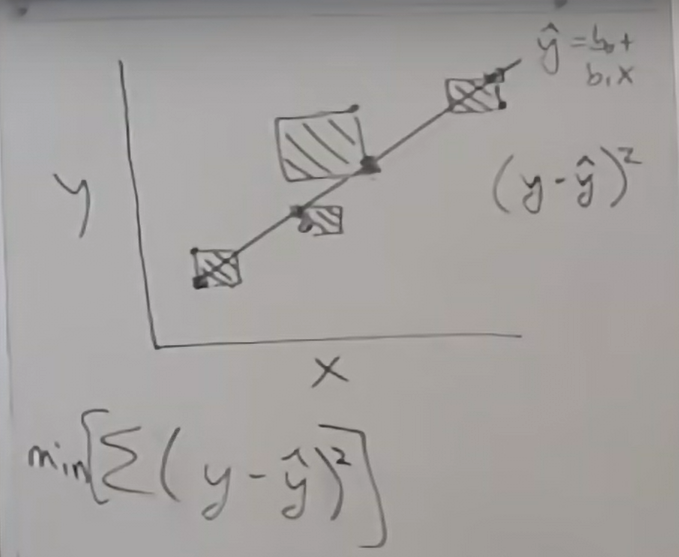
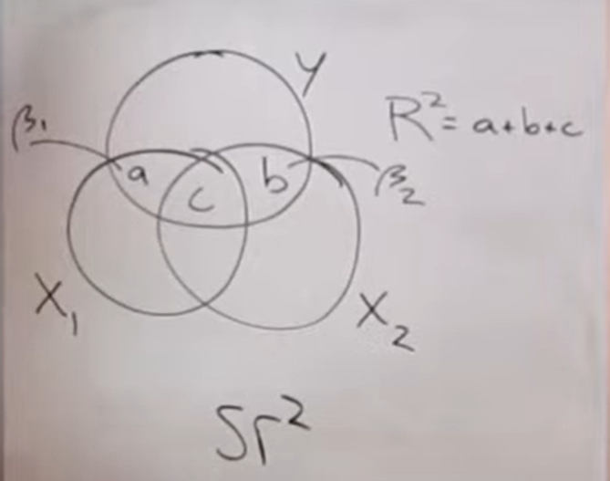
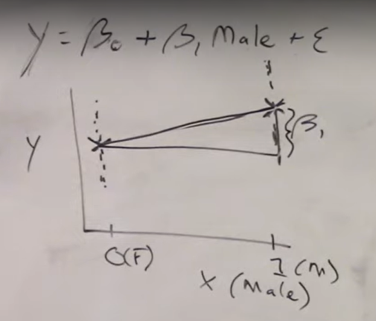
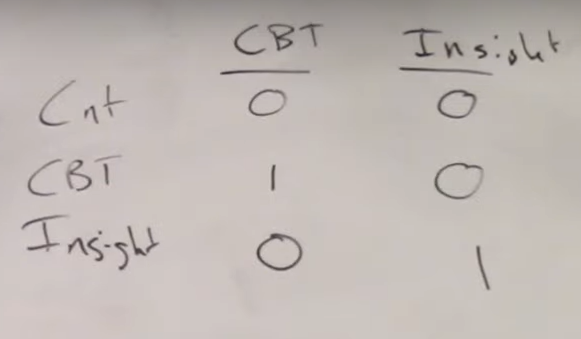

# Linear Regression

```{r setup, include=FALSE}
knitr::opts_chunk$set(echo = TRUE, warning = FALSE, message = FALSE)

library(tidyverse)
library(ggpubr)

theme_set(theme_bw(base_size = 25))
```


Primary reference for this chapter: [Center Stat: Linear Regression Tutorials](https://www.youtube.com/playlist?list=PLQGe6zcSJT0V4xC1NDyQePkyxUj8LWLnD).

## Intro to Linear Regression

Linear regression is the foundation for more advanced techniques like structural equation model, factor analysis, multi level models, mixed effect models, etc. We are interested in exploring the statistical relationship: we are predicting outcomes (not a deterministic relationship).

Uses example with experience and performance where our outcome measure is **experience (x)** and our predictor is **performance (y)**. We can build a model to see how the average level of performance changes as a function of experience. 

In a regression model we have:

$$
Yi = f(x) + \epsilon
$$

- A function to characterize the relationship between x and y 
- And there is also an inherent randomness for any individual represented by $\epsilon$

Of course a linear regression model is linear... so the function is a straight line.

What everyone learned in school:

$$
Y = mx + b
$$

- where m is the slope of the line and b is the intercept

More formally:

$$
Yi = \beta_0 + \beta_1x_i  + \epsilon_i
$$
3 parameters of interest (assuming 1 predictor model)

1. $\beta_0$

- This is the intercept, which can be interpreted as the expected value of y when x = 0.
- Note: sometimes the intercept can be meaningless. 

2. $\beta_1$ 

- Change in y for a 1 unit change in x. Also known as the rise over run. How much change do we expect to change in our outcome given a 1 unit change in our predictor?

3. $\sigma^2$ 

- Variance of residuals

### Demo

I made a fake crossfit dataset for this demo:

- `weight` = weight in pounds
- `classes` = total number of crossfit classes attended
- `clean_weight` = one of the olympic weight movements in crossfit is called cleans. This variable is the max weight in pounds for each individual
- `mile1` = time in minutes to complete mile 1
- `mile2` = time in minutes to complete mile 2

```{r message=FALSE, echo=FALSE}
mydat <- read_csv("data/crossfit.csv")

head(mydat)
```

Let's plot the relationship between classes and cleans. We may predict that the number of classes people attend may positively correlate with clean weight

Of course, we may expect sex to influence our results, but we'll ignore that for now.

```{r}
ggplot(mydat, aes(x=classes, y=clean_weight)) +
  geom_point() +
  theme_bw() +
  labs(x = "Number of Classes", y = "Clean Weight (pounds)")
```

It looks like there's a positive relationship. Let's add in a regression line or line of best fit.

Using the `ggpubr` package, we can add the correlation coefficient (and p-value) along with the regression line equation. 

```{r}
ggplot(mydat, aes(x=classes, y=clean_weight)) +
  geom_point() +
  theme_bw() +
  labs(x = "Number of Classes", y = "Clean Weight (pounds)") +
  geom_smooth(method = "lm", se = FALSE)  +
  stat_cor(label.x = 60, label.y = 80) +
  stat_regline_equation(label.x = 60, label.y = 65) 
```

- Our intercept is 110 which can be interpreted as the expected clean weight with 0 classes.
- Our slope is 1.3 which can be interpreted as with each additional crossfit class attended, clean weight will increase by 1.3 pounds on average.

Here we'll consider the effects of sex:

```{r}
ggplot(mydat, aes(x=classes, y=clean_weight, color=sex)) +
  geom_point() +
  theme_bw() +
  labs(x = "Number of Classes", y = "Clean Weight (pounds)") +
  geom_smooth(method = "lm", se = FALSE)  +
  stat_cor(aes(color = sex), label.x = 5) +
  stat_regline_equation(aes(color = sex), label.x = 35) 
```


## Ordinary Least Sqaures Explained

As a reminder, the example we'll use is looking at the relationship between experience (x) and performance (y). Linear regression will help us to characterize the relationship. 

$$
y = \beta_0 + \beta_1x  + \epsilon
$$
- $\beta_0$ is the value of Y when x = 0

- $\beta_1$ is the expected change in Y for every 1 unit change in x 

How do we obtain the best possible estimates for $\beta_0$ and $\beta_1$? 

In our sample, our model looks like this:

$$
\hat{y} = b_0 + b_1x
$$
$$
y = b_0 + b_1x + e
$$
$$
y = \hat{y} + e
$$
$$
e = y - \hat{y}
$$
- The residual is the difference between the observed data point and the predicted value (e.g., the point on the regression line)
- We want to minimize the overall residual

$$
min[\sum(y - \hat{y})^2]
$$

- Because some data points fall above the regression line and some fall below, there will be some + and some - values, which will cancel out
- We could take the absolute values, but it's easier and more common to take the square of the residuals
- We can visualize this by drawing a box at each data point with the height and width equal to the residual value
- The goal of ordinary least squares is to minimize the sum of the boxes




While we're interested in $beta_0$ and $beta_1$, we get the samples $b_0$ and $b_1$ but we can interpret the estimates in the same way. We use the samples to make inferences of the population parameters. 

One other note, ordinary least squares can be sensitive to outlier observations. We can imagine if there was an outlier in the image above, the box would be much bigger and the regression line would have to account for that. 

## Testing the Model

How much variance of performance can be explained by experience ($R^2)$? More generally, does our predictor(s) have any significant impact on our outcome?

Here, we will focus on overall F model (ANOVA). 

In the absence of any other knowledge about an individual, the best guess you could make with regards to their performance is taking the overall mean ($\bar{y}$). In our F test, we are comparing how much better we do with $\hat{y}$ (when we have more information about x) compared to $\bar{y}$. 

If our predictor value is any good, we would expect any given observed data point to be closer to the predicted value relative to the mean value. 

$$
y = \hat{y} + e
$$
$$
(y-\bar{y}) = (\hat{y}-\bar{y}) + (y-\hat{y})
$$
But we want overall, not just for one individual point. Similar to ordinary least squares, we can take the sums of squares to decompose variability across individuals. 

$$
\sum(y-\bar{y})^2 = \sum(\hat{y}-\bar{y})^2 + \sum(y-\hat{y})^2
$$


$$
SS_{TOT} = SS_{REG} + SS_{ERR}
$$ 
A good model:

- $SS_{REG}$ = large
- $SS_{ERR}$ = small

$$
R^2 = SS_{REG}/SS_{TOT} 
$$ 
$R^2$ = coefficient of determination, which can be interpreted as the proportion of variance in y (performance) that is explained by x (experience).

- $R^2$ = .2 means that 20% of variance in performance is explained by experience. 
- But at what point can we confidently say that a real effect does exist?

### Degrees of Freedom 

Degrees of freedom = how many unique pieces of information do you have? and how many pieces of information did you use up? Subtract how many you used up from how many you had to get DF. 


$$
\sum(y-\bar{y})^2 = \sum(\hat{y}-\bar{y})^2 + \sum(y-\hat{y})^2
$$ 
$$
(N-1) = (p-1) + (N-p)
$$
*p is number of parameters in regression model

$$
\sum(y-\bar{y})^2/(N-1) = \sum(\hat{y}-\bar{y})^2/(p-1) + \sum(y-\hat{y})^2/(N-p)
$$  
Which also equals:

$$
MS_{TOT} \neq MS_{REG} + MS_{ERR}
$$ 
*note this is not additive 

Why go through all of this?? Because we can get a ratio. 

$$
F^* = MS_{REG} / MS_{ERR}
$$ 
- One way to think about this is like a signal to noise ratio.
- Under the null hypothesis:

$$
F^*  \sim F(p-1, N-p)
$$ 
F distribution is an asymmetric distribution. If there's really no effect, most F* will be on the low end. If there's an effect, F* will be far out in the tail of the distribution and when you calculate the area under the curve beyond F*, it will be < 0.05 and can conclude, model is explaining variance in the outcome. 

Report something that looks like this (numbers are completely made up):

$R^2$ = .43; F(1,15) = 17.3; p = 0.012. 

### Demo 1

How does the number of classes you attend affect your clean weight?

```{r}
mydat

ggplot(mydat, aes(x=classes, y=clean_weight)) +
  geom_point() +
  theme_bw() +
  labs(x = "Number of Classes", y = "Clean Weight (pounds)") +
  geom_smooth(method = "lm", se = FALSE)  +
  stat_cor(label.x = 60, label.y = 80) +
  stat_regline_equation(label.x = 60, label.y = 65) 
```

- Is the strength of the data sufficient to conclude that there's actually a relationship in the population and not just due to chance

```{r}
m1 <- lm(classes ~ clean_weight, data = mydat)

summary(m1)
```

$R^2$ = .34; F(1,13) = 6.671; p = 0.023

### Demo 2

How does the number of beers you drink affect your sobriety test score? 

```{r}
data_beer <- read_csv("data/beers.csv")

data_beer

plot_beers_sobriety <- ggplot(data_beer, aes(x=beers, y=second_sober)) +
  geom_point() +
  theme_bw() +
  labs(x = "Number of Beers", y = "Test Score") +
  geom_smooth(method = "lm", se = FALSE)  +
  stat_cor(label.x = 5, label.y = 5.5) +
  stat_regline_equation(label.x = 5, label.y = 5) 
```

```{r}
m_beers <- lm(beers ~ second_sober, data = data_beer)

summary(m_beers)
```

$R^2$ = .34; F(1,14) = 7.37; p = 0.0168

- Right now, only one predictor, so the t test and the F test are essentially testing the same thing, but once you have more predictors, the t tests will test each individual predictor and the F test will give an overall results for entire set of predictors. 

## Inferences about Specific Parameters

Reminder....

Population:

$$
Y = \beta_0 + \beta_1  + \epsilon
$$

Sample:

$$
y = b_0 + b_1  + e
$$
- goal is to take estimates of $b_0$ and $b_1$ and make inferences about population parameters
- t tests and confidence can help us understand

### T test

Null hypothesis:

$$
H_0: \beta_1 = 0
$$
Alternative hypothesis (two-tailed):

$$
H_A: \beta_1 \neq 0
$$
or one tail (> or <):

$$
H_A: \beta_1 > 0
$$
To calculate a z statistic you would need to know the SD 

$$
(\beta_1 - 0)/SD(\beta_1)
$$
But we don't know the SD, we can only obtain an estimate SE, which leads us to the T statistic as opposed to Z statistic

$$
t^* = (\beta_1 - 0)/SE(\beta_1)
$$
Where...

$$
t^* \sim t(N-P)
$$
Essentially, you just look up the t statistic and get your p value.

#### Demo 

- looking at relationship between beers consumed and road sobriety test score

```{r}
data_beer

plot_beers_sobriety

summary(m_beers)
```

- reject null hypothesis because t value = -2.714 which is unlikely to happen by chance
- rejecting means we accept the alternative which is that it is not 0...but how helpful is that really?

### Confidence Intervals

CI have a number of advantages over t tests:

- overall precision of estimate
- interval of plausible range of values for $beta_1$
- interval excludes 0 = reject null = significant test
- interval includes 0 = no reject null = non-significant test

Like t test, the idea is that we can sample from our population over and over again and get a sampling distribution of values for our estimated slopes, so based on the idea of repeated sampling. We expect that 95% of the sampled $b_1$ estimates would fall within +/- 2 SD interval (that includes the true $\beta_1$ parameter). So the idea is, we take our estimate and extend by our margin of error (+/- 2 SD) and 95% of the time, that should include the actual $\beta_1$ (the true value).

But, again we don't know the SD. So, instead we take the t value.

Confidence interval:

$$
b_1 +- t_{crit}(alpha, N-p)SE(b_1)
$$

```{r}
confint(m_beers)
```

CI: -1.6 to -0.190, excludes 0 so reject null. We have no way to know if this specific interval is one of the 5% that does not include the true value, but good odds which we are willing to take. 

How to interpret CI?
- 95% of the time our interval will contain the true population value, but no way to know if this interval is one of the 95% or not

## Multiple Regression

In practice, we usually have more than one predictor of interest. 

$$
y = \beta_0 + \beta_1x_1 + \epsilon
$$
$$
y = \beta_0 + \beta_1x_1 + \beta_2x_2 + \epsilon
$$
With two predictors, rather than a line we end up having another dimension for the new predictor so we have a regression plane. As soon as you get more than 2 predictors, it's almost hard or impossible to visualize, but the math is still relatively similar straightforward.

Why is multiple regression so powerful?

1. Multidetermined - in multiple regression we can to incorporate multiple determinants of an outcome simultaneously 
2. Enhance predictions - can increase our $R^2$ to make our model better by explaining more variance
3. MSE decreases - can often result in increased power
4. Statistical control - especially when we have potentially confounding variables. We can estimate the effect of each individual predictor while holding the others constant or controlling for the other predictors

$$
E(y) = \beta_0 + \beta_1x
$$
Remember the intercept is:

$$
E(y|x=0) = \beta_0 
$$
And our slope is:


$$
E(y|x=a) = \beta_0 + \beta_1a
$$

$$
E(y|x=a+1) = \beta_0 + \beta_1(a+1)
$$
If we take the difference, we're left with $\beta_1$ which is our slope. In other words, our slope is the change in y as a function of a 1 unit difference in x.

We have to account for the fact that variables may be related or confounded with each other. 

With multiple predictors, our intercept is very similar:

$$
E(y|x_1=0, x_2=0) = \beta_0 
$$
For our slope, we want to try to understand the effect of $x_1$, which holding $x_2$ constant:

$$
E(y|x_1=a, x_2=c) = \beta_0 + \beta_1a + \beta_2c
$$
And now let's see what happens when we increase a by a unit of 1, while still holding $x_2$ constant:

$$
E(y|x_1=a+1, x_2=c) = \beta_0 + \beta_1(a+1) + \beta_2c
$$
Again, if we take the difference between these two, most things cancel out. Importantly, $\beta_2c$ gets canceled out and we're left with $\beta_1$. This is the power of multiple regression, having the ability to do this sort of statistical control. $\beta_1$ is the effect of $x_1$ holding $x_2$ constant and $\beta_2$ is the effect of $x_2$ holding $x_1$ constant.

We can represent the variance of our predictors by using circles (see below). There is some overlap (speaks to the relationship between $x_1$ and $x_2$) and there is overlap with our outcome Y. There are 3 areas that represent variance we are explaining in our outcome as a function of our two predictors. 



- $R^2 = a + b + c$
- a is unique to $x_1$ and is $\beta_1$
- b is unique to $x_2$ and is $\beta_2$
- c is interesting because it could be predicted by either predictor
- $sr^2$ standardizes $\beta_1$ and $\beta_2$ into the same kind of metric as $R^2$ to give you the percent of variance explained and can be extending for a model with more predictors.

### Demo 1: US arrests

- US arrests in each state
- always good to visualize data before jumping into analysis, for example, can check for outliers
- the correlation matrix is also useful to see how predictors may be related to each other

```{r}
library(GGally) 
library(janitor)

data_arrests <- USArrests %>%
  as_tibble() %>%
  clean_names()

data_arrests

ggpairs(data_arrests)

```

First model, we'll look at using just 1 predictor:

```{r}
m1 <- lm(murder ~ assault, data = data_arrests)

summary(m1)
```

- $R^2$ is 0.64, so we're already explaining a good proportion of the variance with this one predictor.
- Our p value indicates we're explaining more variance than by chance alone (it's significant)

Second model, we'll look at using 2 predictors:

```{r}
m2 <- lm(murder ~ assault + urban_pop, data = data_arrests)

summary(m2)
```

- $R^2$ is now 0.66, so we're explaining a little bit more variance 
- We have a significant F-test, which is a test of the model as a whole
- Looking at the t tests is helpful for understanding each individual predictor while controlling for the other predictors
- Assault is a significant predictor, but urban population is not 

Here's a package to get the squared semi partial correlation, which tells you the contribution each predictor makes to the overall model. Note, there is some shared predicted variance, but the squared semi partial correlation gives us the unique variance for each predictor. This means that if you add up the squared semi partial proportions, it will not add up to the $R^2$. 

```{r}
library(BetterReg)

parts(model = m2, pred=2)
```

### Demo 2: CrossFit data

Here we're looking at the outcome of clean weight with predictors of: weight and time on mile 1.

```{r}
mydat

ggpairs(mydat)

m3 <- lm(clean_weight ~ weight + mile1, data = mydat)

summary(m3)

parts(model = m2, pred=2)
```

- Overall, F test is significant 
- t test for weight is significant 
- t test for mile 1 is marginally significant
- we can see that weight accounts for a much greater proportion of the explained variance, so the dominant predictor in our model

## Categorical Predictors

- example: sex difference in anti social behavioral in adolescents 
  - could do this as a t sample t test
  - OR could do this as a regression model

$$
Y  = \beta_0 + \beta_1male + \epsilon
$$
- male = 0 (female)
- male = 1 (male)

*male is our 1 indicator variable*

In our continuous predictor examples, if you plot out the data points, you'll get a scatter plot. But with a categorical predictor, if you plot it out, you'll get a bunch of dots at 0 for female and 1 for male. We're still interested in the mean difference. Regression slope is the change in y for 1 unit change in x. So if you mark the mean at 0 and the mean at 1 and draw a line connecting the two, that would be your slope and can draw the triangle to get your $\beta_1$.




$$
E(Y|male = 0) = \beta_0 
$$
- this is our $\mu_1$ or mean for females

$$
E(Y|male = 1) = \beta_0 + \beta_1
$$

- this is our $\mu_2$ or mean for males

$$
\mu_2 - \mu_1 = \beta_1
$$

So we get 2 parameters out of our regression model: $\beta_1$ and $\beta_2$ 
- $\beta_1$ is the parameter that gives us the mean difference between the two groups
- $\beta_2$ is interpreted as the mean of whatever group has been coded as 0, in this case mean for females.

### What if we have a predictor with 3+ categories

- one way ANOVA model or we can use a regression model
- **example: marital couples assigned to 3 possible conditions (control, CBT, insight oriented)**
- we need C-1 (conditions - 1) indicator variables/coding variables (if I know you're not in control or CBT, you must be in insight - so 2 indicators would be necessary)

- 3 categories, we need 2 coding variables
- let's make control the reference group 



Our regression model: 

$$
Y = \beta_0 + \beta_1CBT + \beta_2Insight + \epsilon
$$
$$
E(y|control = \beta_0)
$$
$$
E(y|CBT = \beta_0 + \beta_1)
$$
By plugging into our regression equation:
- CBT is coded as 1 for CBT, so we have to add $\beta_1$ (because $\beta_1$x1)
- But CBT is coded as 0 for insight, so we do not add $\beta_1$ (because it would just be $\beta_2$x0)

$$
E(y|insight = \beta_0 + \beta_2)
$$
So interpreting our parameters:
- $\beta_0$ represents average for the control group
- $\beta_1$ is the mean difference between CBT and control
- $\beta_2$ is the mean difference between insight and control  

To get the overall main effect, we want to test $\beta_1$ AND $\beta_2$ (rather than them individually)

- in an ANOVA our $H_0$ would look something like this:

$$
H_0: \mu_{control} = \mu_{CBT} = \mu_{insight}
$$

- in our regression model our $H_0$ would look something like this:


$H_0$: $\beta_1$ AND $\beta_2$ are simultaneously 0. 

So we'll do a joint test of both parameters simultaneously. Do the two parameters ($\beta_1$ and $\beta_2$) in our model offer a better improvement to the fit compared to just having $beta_0$.

### Continuous + Categorical Predictors

Doing a regression model as opposed to an ANOVA allows for the flexibility to include a mix of continuous and categorical predictors. 

- example, let's add in a continuous variable of "baseline satisfaction" (BL)

$$
Y = \beta_0 + \beta_1CBT + \beta_2insight + \beta_3BL + \epsilon
$$
- so now we have a mix of categorical and continuous variables
- analogous to ANCOVA - analysis of covariants
- BL will be held as constant in below equations

$$
E(y|control, BL = c) = \beta_0 + \beta_3c)
$$
$$
E(y|CBT, BL = c) = \beta_0 + \beta_1 + \beta_3c)
$$
$$
E(y|insight, BL = c) = \beta_0 + \beta_2 + \beta_3c)
$$
- $\beta_1$ is the difference between control and CBT while holding BL constant
- $\beta_2$ is the difference between control and insight while holding BL constant
- this model results in 1 slope from $\beta_3$ and we really have 3 intercepts to adjust the levels of regression line for each of the categories (Control, CBT, insight)
- note: this model is looking at simple main effects only, not considering interactions


